# Assignment 1 — VPC & Networking

A custom VPC built from scratch: one public subnet, one private subnet, internet access wired up correctly for both, and an EC2 instance in each — public one directly reachable, private one reachable only through the public.

## Objective

Create a custom VPC with a public and a private subnet, set up correct routing for internet access, and deploy EC2 instances across both — with the private instance having no direct exposure to the internet, only outbound access via a NAT Gateway.

## Region

`ap-south-1` (Asia Pacific — Mumbai) — a single region.
Everything below spans **two Availability Zones** within it (`ap-south-1a` and `ap-south-1b`), which is an AWS requirement for an internet-facing ALB, not a second region.

## Architecture

```
                        Internet
                            |
                    Internet Gateway
                     (devops-lab-igw)
                            |
        VPC — devops-lab-vpc (10.0.0.0/16)
        |                                   |
   public-subnet-a (10.0.1.0/24)     private-subnet-a (10.0.2.0/24)
   rtb-public: 0.0.0.0/0 -> IGW      rtb-private: 0.0.0.0/0 -> NAT GW
        |                                   |
   ec2-public                         ec2-private
   (public IP, sg-public)             (no public IP, sg-private)
        |
   NAT Gateway (devops-lab-natgw)
   + Elastic IP
```

The private instance has no route in from the internet at all — the only way to reach it is by SSHing into the public instance first, then hopping from there. It still has outbound internet access (for package updates, etc.) via the NAT Gateway sitting in the public subnet.

## Resources created

| Resource                 | Name             | ID                         | Details                                                       |
|--------------------------|------------------|----------------------------|---------------------------------------------------------------|
| VPC                      | devops-lab-vpc   | `vpc-09dad1504ee51317d`    | `10.0.0.0/16`                                                 |
| Subnet (public)          | public-subnet-a  | `subnet-0130484a505abf9cb` | `10.0.1.0/24`, AZ `ap-south-1a`                               |
| Subnet (private)         | private-subnet-a | `subnet-03c8472b505772451` | `10.0.2.0/24`, AZ `ap-south-1a`                               |
| Internet Gateway         | devops-lab-igw   | `igw-0d969221951fc716b`    | Attached to devops-lab-vpc                                    |
| Elastic IP               | —                | `13.206.46.199`            | Bound to the NAT Gateway                                      |
| NAT Gateway              | devops-lab-natgw | `nat-08b6ad34e4cb34629`    | Public connectivity, sits in public-subnet-a                  |
| Route table (public)     | rtb-public       | `rtb-0224b0ea353e18b64`    | `0.0.0.0/0 → igw-0d969221951fc716b`                           |
| Route table (private)    | rtb-private      | `rtb-038f7b2952cdfb2d4`    | `0.0.0.0/0 → nat-08b6ad34e4cb34629`                           |
| Key pair                 | public-ec2       | `key-039896040ab110adc`    | RSA                                                           |
| Security group (public)  | public-sg        | `sg-006eebdaaa2790c55`     | Inbound: HTTP 80, SSH 22                                      |
| Security group (private) | private-sg       | `sg-05082f818dea7d136`     | Inbound: SSH 22, source = `public-sg`                         |
| EC2 (public)             | ec2-public       | `i-0269dd82ea1581399`      | `t3.micro`, public IP `3.111.217.254`, private IP `10.0.1.86` |
| EC2 (private)            | ec2-private      | `i-067730ad27fc1c143`      | `t3.micro`, no public IP, private IP `10.0.2.175`             |

Both route tables also carry the implicit `10.0.0.0/16 → local` route AWS adds automatically, which is what lets the two subnets reach each other.

## Security group design

sg-private's only inbound rule sources traffic from `sg-public` itself, rather than a specific IP or CIDR block. That means SSH access to the private instance is granted to whatever has `sg-public` attached, not to a specific address that would break if the public instance were ever replaced.

## Testing performed

1. **SSH into the public instance directly** — `ssh -i public-ec2.pem ec2-user@3.111.217.254` — succeeded.
2. **Hop from the public instance to the private instance** — `ssh -i public-ec2.pem ec2-user@10.0.2.175` from inside the public instance's session — succeeded, using the same key pair copied onto the public instance.
3. **Outbound internet from the private instance** — `curl -I https://amazon.com` from inside the private instance returned `HTTP/1.1 301 Moved Permanently`, confirming the NAT Gateway path works.
4. **Isolation check** — a direct SSH attempt from the local machine straight to the private instance's IP timed out, as expected. No route exists into the private subnet except through the public instance.

## Screenshots

**VPC**

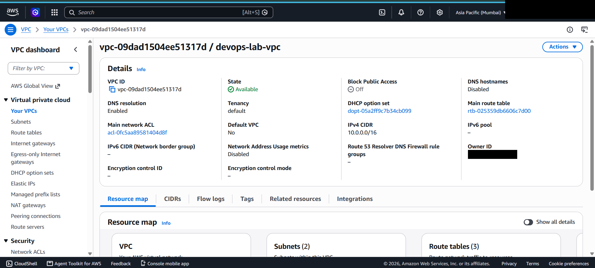

**Subnets**

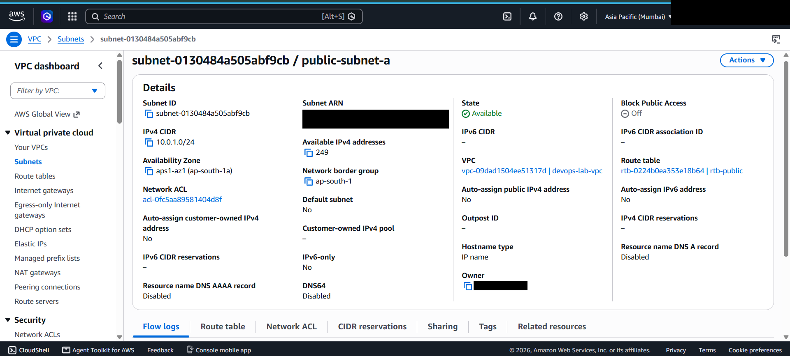
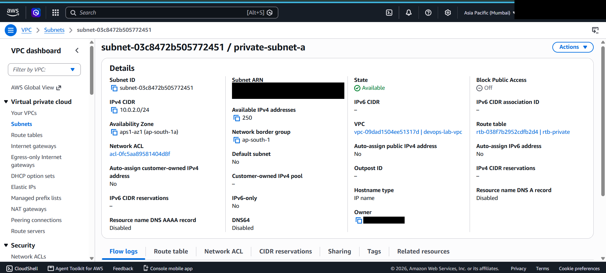

**Internet Gateway & NAT Gateway**

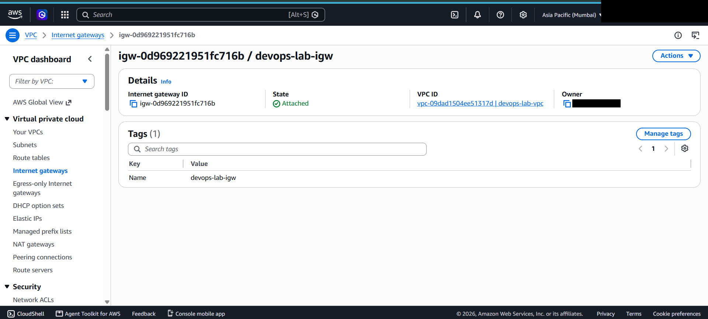
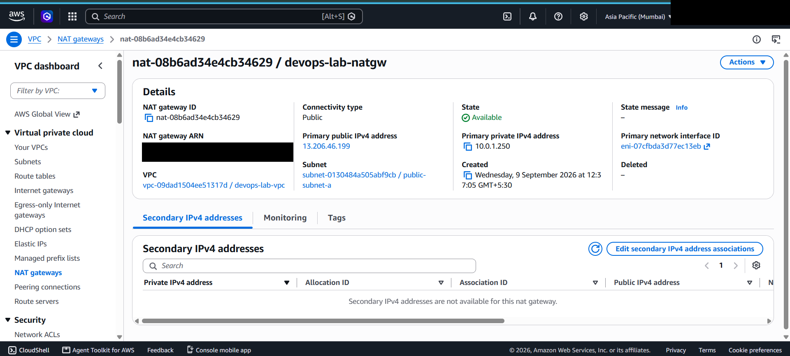
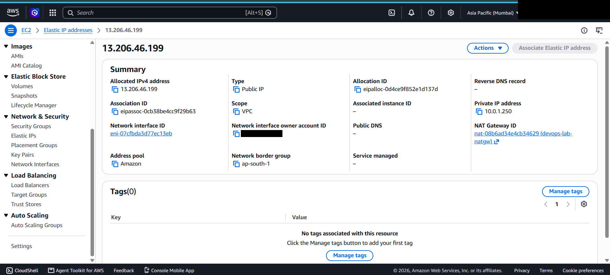

**Route tables**

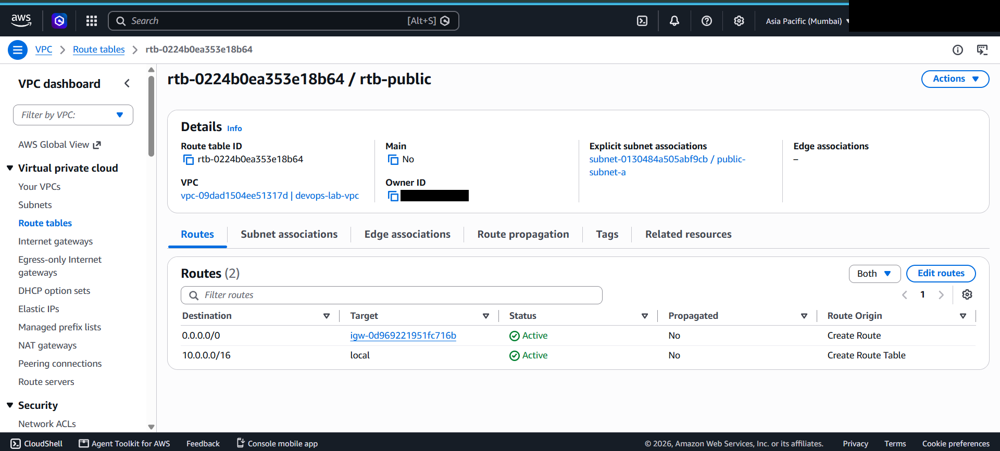
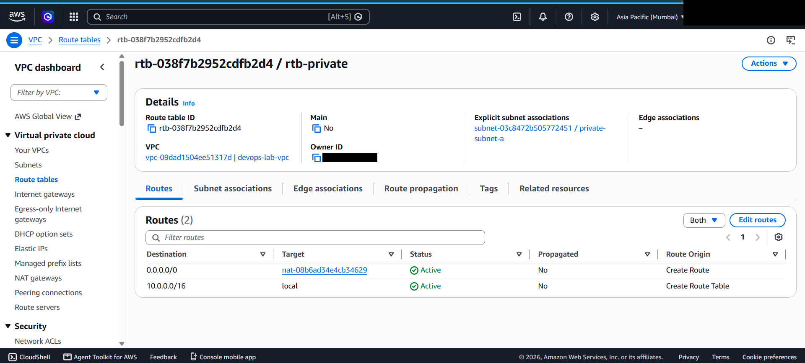

**Security groups**

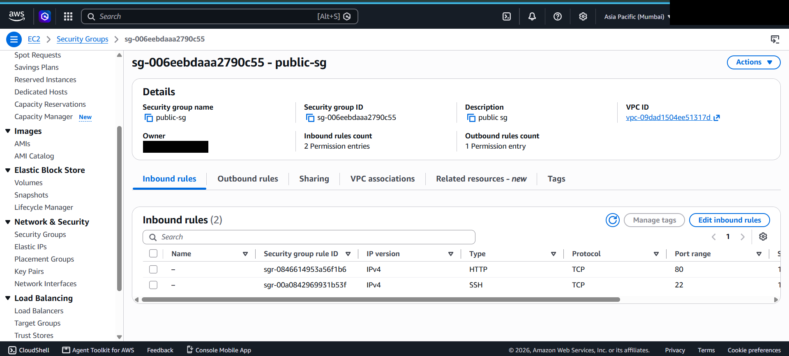
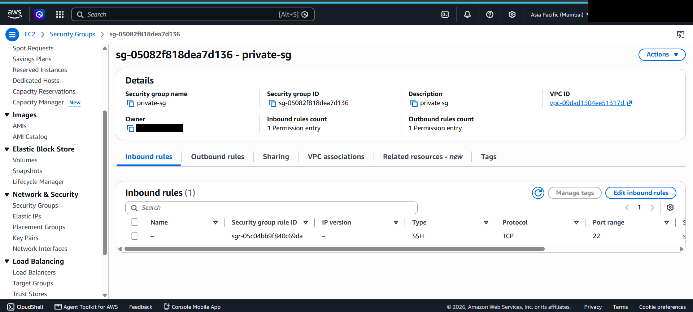

**EC2 instances**

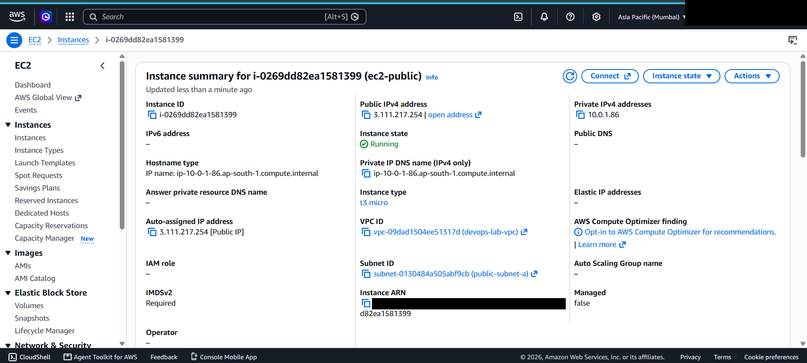
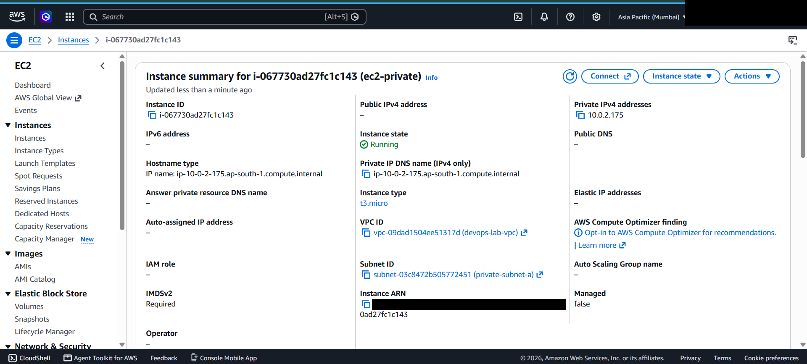

**Key pair**

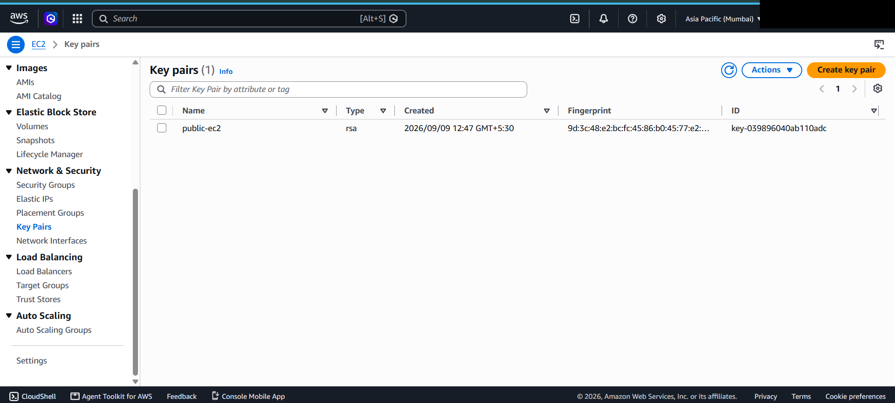

## Cleanup

The NAT Gateway and its Elastic IP are billable while running (roughly $0.045/hr plus data processing for the NAT Gateway, and the EIP bills once it's unattached). Once this documentation is captured, delete the NAT Gateway and release the Elastic IP — the VPC, subnets, route tables, IGW, security groups, and a stopped/terminated EC2 instance.
