# Assignment 2 — Application Load Balancer

Two EC2 instances behind an Application Load Balancer, with the instances made unreachable directly — not by hiding them in a private subnet, but purely through security group rules.

## Objective

Set up an ALB in front of two EC2 instances so all incoming traffic is handled by the load balancer, and neither instance is directly accessible from the internet.

## Region

`ap-south-1` (Asia Pacific — Mumbai) — a single region.
Everything below spans **two Availability Zones** within it (`ap-south-1a` and `ap-south-1b`), which is an AWS requirement for an internet-facing ALB, not a second region.

## Architecture

```
                        Internet
                            |
                    Internet Gateway
                     (devops-lab-igw)
                            |
        VPC — devops-lab-vpc (10.0.0.0/16)
        |                                   |
   public-subnet-a (10.0.1.0/24)     public-subnet-b (10.0.2.0/24)
        |                                   |
        -------------- alb-sg --------------
                            |
              Application Load Balancer
                  (devops-lab-alb)
                            |
                     app-tg (target group)
                     health check: HTTP /
                    /                     \
              web-1 (app-sg)         web-2 (app-sg)
           ap-south-1a, public IP   ap-south-1b, public IP
```

Both EC2 instances sit in **public subnets** with real, routable public IPs — there's no private subnet and no NAT Gateway in this build. What actually blocks direct access is `app-sg`: its only inbound rule allows HTTP:80, and the *source* of that rule is `alb-sg` itself (referenced by security group ID, not a CIDR block). Nothing other than the ALB has permission to reach port 80 on the instances, and there's no SSH rule at all. The isolation lives entirely in the security group graph, not in the network topology.

## Resources created

| Resource             | Name            | ID / Value                                             | Details                             |
|----------------------|-----------------|--------------------------------------------------------|-------------------------------------|
| VPC                  | devops-lab-vpc  | `vpc-08a375cb60d55ced8`                                | `10.0.0.0/16`                       |
| Subnet (public)      | public-subnet-a | `subnet-037bc3e5180c8caf7`                             | `10.0.1.0/24`, AZ `ap-south-1a`     |
| Subnet (public)      | public-subnet-b | `subnet-0d4a5b0d77424a9bf`                             | `10.0.2.0/24`, AZ `ap-south-1b`     |
| Internet Gateway     | devops-lab-igw  | `igw-0fbdba457d85932ec`                                | Attached to devops-lab-vpc          |
| Route table          | rtb-public      | `rtb-0f2b1ded6bfd1077a`                                | `0.0.0.0/0 → IGW`, both subnets     |
| Key pair             | public-ec2      | —                                                      | RSA                                 |
| Security group (ALB) | alb-sg          | `sg-0fd7f0710b851137a`                                 | Inbound: HTTP 80 from `0.0.0.0/0`   |
| Security group (app) | app-sg          | `sg-058dd1c58665327c9`                                 | Inbound: HTTP 80, source = `alb-sg` |
| EC2 (web-1)          | web-1           | `i-086755b3b7f856f09`                                  | `t3.micro`, public `3.110.182.55`   |
| EC2 (web-2)          | web-2           | `i-00febeb6ada3f3207`                                  | `t3.micro`, public `15.252.99.234`  |
| Target group         | app-tg          | `.../targetgroup/app-tg/b95b42e5cf010646`              | HTTP:80, health check on `/`        |
| Load balancer        | devops-lab-alb  | `.../loadbalancer/app/devops-lab-alb/80795d41c3d6351a` | Internet-facing                     |
| ALB DNS name         | —               | `devops-lab-alb-40882054.ap-south-1.elb.amazonaws.com` | Entry point for all traffic         |

Full instance details (private IPs, subnet placement) and full ARNs are in the screenshots below

The route table also carries the implicit `10.0.0.0/16 → local` route AWS adds automatically.

## Security group design

This is the part of the build that replaces network-level isolation with security-group-level isolation:

- **alb-sg** allows inbound HTTP:80 from anywhere (`0.0.0.0/0`) — it's the only thing meant to face the public internet.
- **app-sg** allows inbound HTTP:80 from **alb-sg only**, referenced as a security group source rather than an IP range. No SSH rule exists on `app-sg` at all.

Because the source is a security-group reference rather than a CIDR block, the rule follows whatever has `alb-sg` attached rather than a fixed address — if the ALB were rebuilt with a new IP, the rule would still hold. Both instances have real public IPs (they're in public subnets), but `app-sg` is the only thing standing between them and the internet, and it only lets the ALB through.

## Testing performed

1. **Target group health** — both `web-1` and `web-2` show as **Healthy** in `app-tg` (2 total / 2 healthy / 0 unhealthy).
2. **Round-robin via the ALB** — hitting `http://devops-lab-alb-40882054.ap-south-1.elb.amazonaws.com` repeatedly returned alternating pages, **"Web Server 1 — ap-south-1a"** and **"Web Server 2 — ap-south-1b"**, confirming the ALB is distributing traffic across both instances.
3. **Direct public-IP access blocked** — `curl -v --max-time 5` against each instance's public IP directly (bypassing the ALB) timed out on both:
   ```
   curl -v --max-time 5 http://3.110.182.55/    -> Connection timed out after 5003 milliseconds
   curl -v --max-time 5 http://15.252.99.234/   -> Connection timed out after 5003 milliseconds
   ```
   This is the proof that `app-sg` — not subnet placement — is what's blocking access, since both instances have fully routable public IPs.

## Screenshots

**VPC & networking**

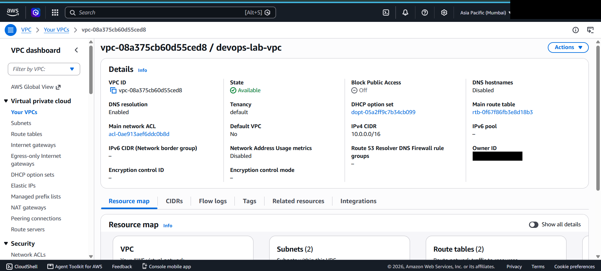

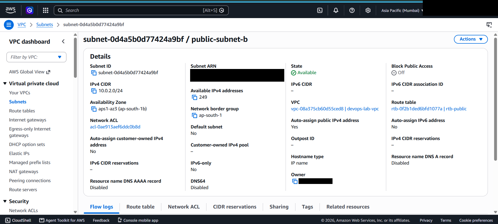
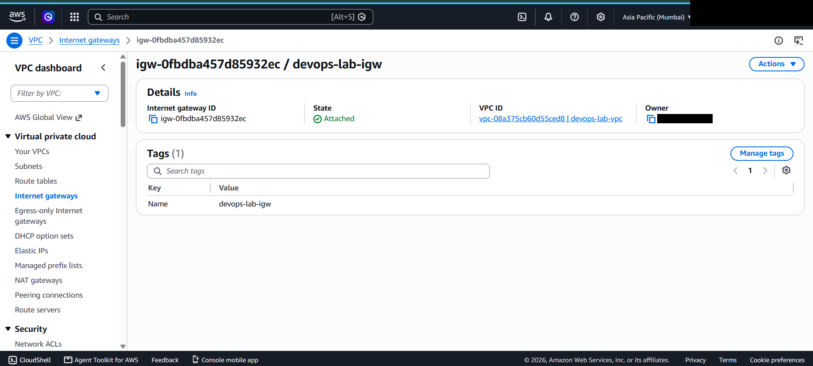
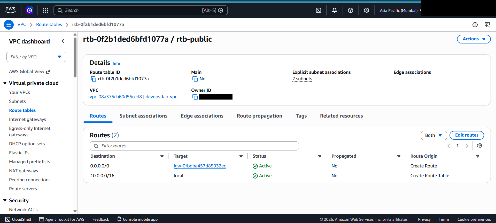

**Security groups**

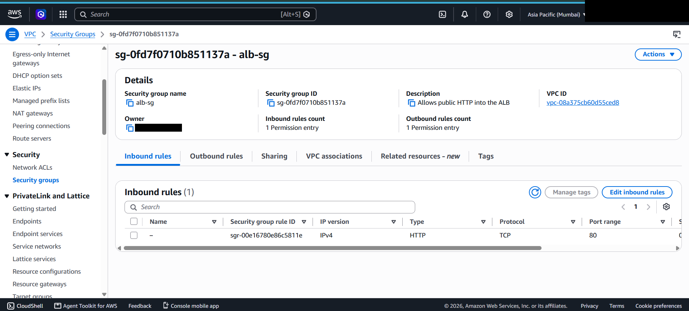
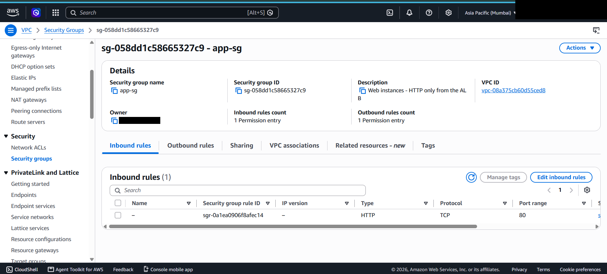

**EC2 instances**

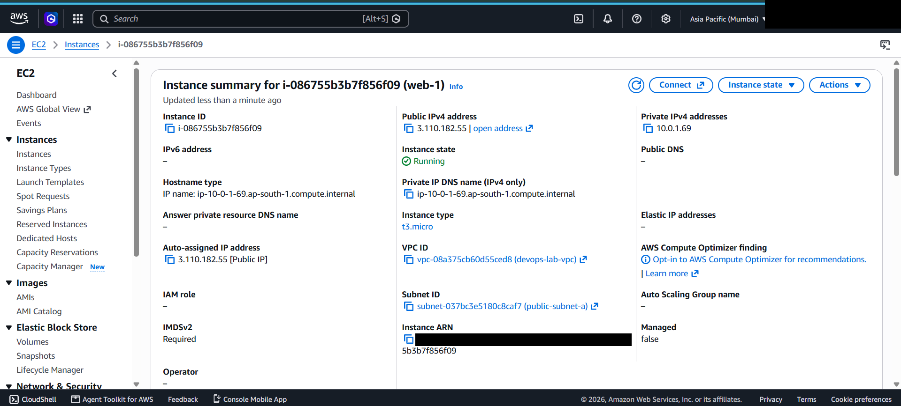


**Target group & load balancer**

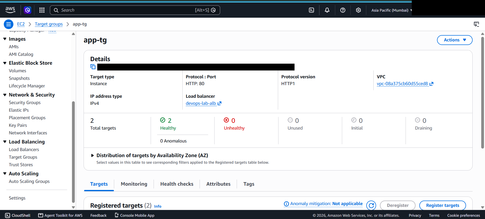
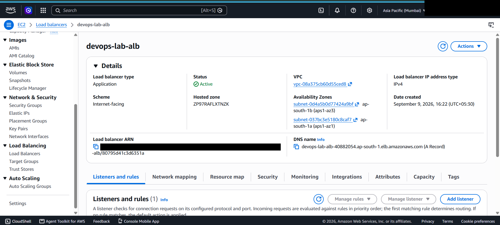

**Testing**


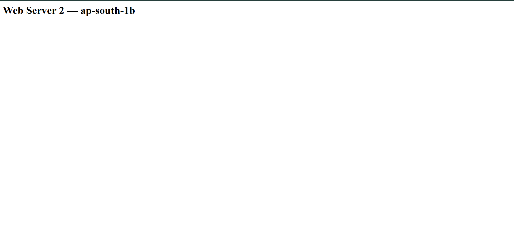
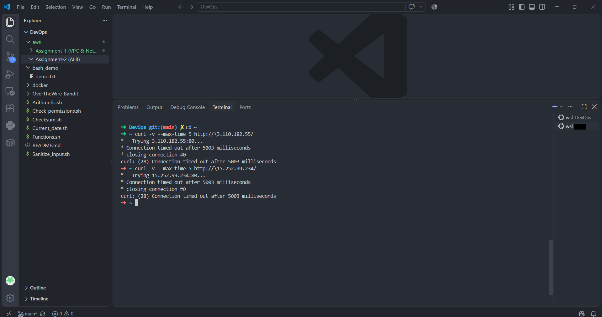

## Cleanup

The ALB and the two `t3.micro` instances are the ongoing costs here (roughly $0.0225/hr for the ALB plus LCU usage, and standard EC2 pricing for the two instances) — there's no NAT Gateway this time, so no separate hourly charge for that. Once this documentation is captured: delete the ALB, deregister/delete the target group, terminate both EC2 instances. The VPC, subnets, route table, IGW, key pair, and security groups cost nothing to leave.
