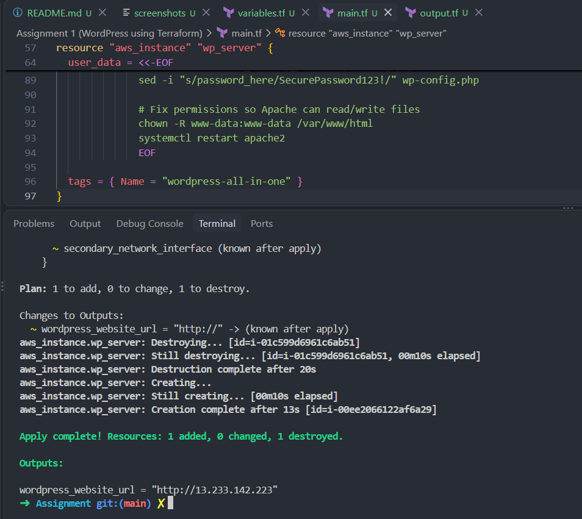
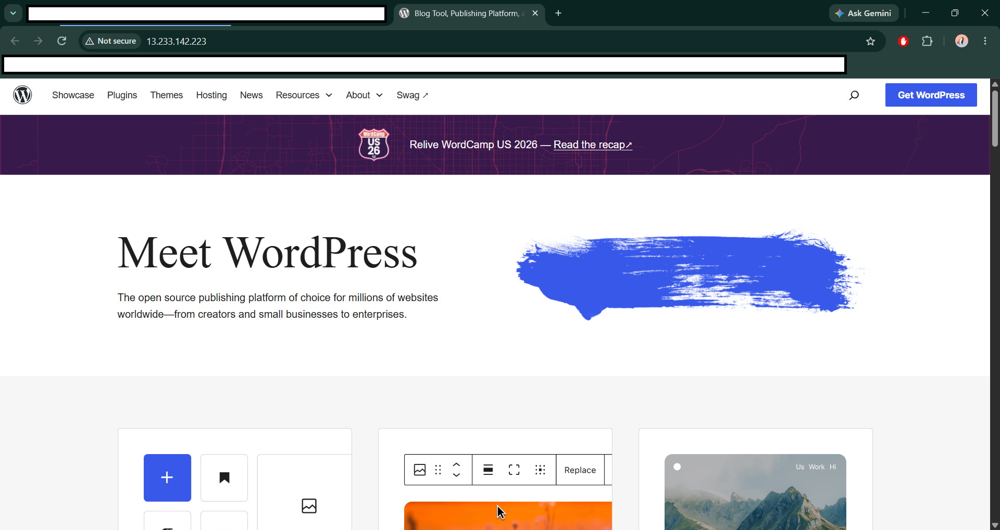
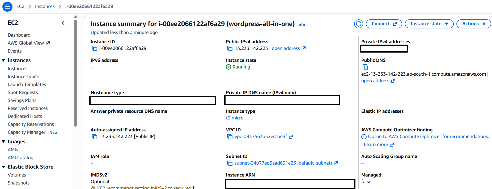
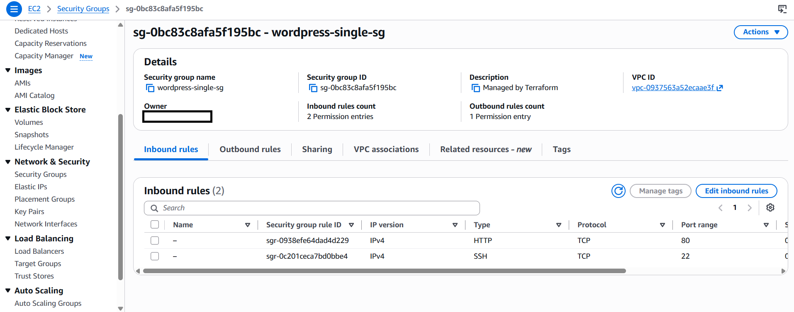

# WordPress Infrastructure on AWS using Terraform

A minimalist, automated deployment of a **WordPress stack on AWS** using infrastructure as code (IaC). This configuration collapses networking, firewalls, and server provisioning into **`main.tf`, `variables.tf`, and `output.tf` files** for rapid testing and deployment.

## 🚀 Architecture Highlights
* **Architecture**: Combines Apache, PHP, MySQL, and WordPress onto a single, cost-efficient EC2 t3.micro instance.
* **Default VPC Integration**: Leverages existing default AWS subnets to drastically simplify networking code.
* **Automated Bootstrap**: Uses EC2 `user_data` to fully install, configure, and secure the software stack over a modern Ubuntu 22.04 LTS image.

## 📂 Project Structure

The project is structured into three standard Terraform files:
* **`main.tf`**: Contains core infrastructure definitions (Provider, Data sources, Security Groups, and the EC2 Instance).
* **`variables.tf`**: Houses configuration inputs like the default AWS region and instance types.
* **`outputs.tf`**: Exposes the final public URL of the deployed WordPress website.

## 🛠 Prerequisites

Before running this project, ensure you have the following ready on your local machine:
1. **Terraform CLI** (v1.0.0+) installed.
2. **AWS Credentials** configured in your environment via the AWS CLI (`aws configure`) or environment variables:
   ```bash
   export AWS_ACCESS_KEY_ID="your_access_key"
   export AWS_SECRET_ACCESS_KEY="your_secret_key"
   export AWS_DEFAULT_REGION="your_default_region"
   ```

## 🗺 Architecture Diagram Description

```text
       [ Public Internet ]
               │
               ▼  (HTTP / Port 80)
     ┌────────────────────────┐
     │   AWS Security Group   │ (Firewall)
     └───────────┬────────────┘
                 │
                 ▼
  ┌──────────────────────────────┐
  │      Amazon EC2 Instance     │ (Ubuntu 22.04 LTS)
  │  ┌────────┐ ┌──────┐ ┌────┐  │
  │  │ Apache │ │ MySQL│ │ PHP│  │ (Software Stack)
  │  └────────┘ └──────┘ └────┘  │
  │              ▼               │
  │         [WordPress]          │
  └──────────────────────────────┘
                 │
                 ▼  (Outbound Protocol: -1)
          [ AWS Internet ] ───► System Updates & Core Repositories
```

## ⚡ Deployment Steps

Deploy the entire stack with just three terminal commands:-

### 1. Initialize Terraform
Downloads the required HashiCorp AWS provider binaries.
```bash
terraform init
```

### 2. Generate a Preview Plan
Creates a safe, read-only preview showing exactly what AWS resources Terraform will create or modify.
```bash
terraform plan
```

### 3. Launch the Infrastructure
Provisions the security group, fetches the latest Ubuntu AMI, launches the EC2 instance, and executes the WordPress bootstrap script.
```bash
terraform apply
```

## 🌐 Accessing the Site

Upon a successful apply, Terraform will output your live website link:

```bash
Outputs:

wordpress_website_url = "http://xx.xx.xx.xx"
```

1. Copy the output URL and paste it into your web browser.
2. *Note: The server takes roughly **1 to 2 minutes** after provisioning to finish downloading WordPress and configuring MySQL. If the page doesn't load immediately, wait 60 seconds and refresh.*
3. Complete the famous 5-minute WordPress installation wizard!

## Network Security (Firewall)

The infrastructure configures an AWS Security Group with the following rules:

### Inbound (Ingress)
* **Port 80 (HTTP)**: Open to the world (`0.0.0.0/0`) for web visitors.
* **Port 22 (SSH)**: Open to the world (`0.0.0.0/0`) for administration.

### Outbound (Egress)
* **Protocol `-1` (All)**: Allowed out to the entire internet (`0.0.0.0/0`). This allows the server to pull system updates, install Apache/PHP packages, and communicate with WordPress core repositories.

## 📸 Assignment Screenshots

### Terminal Output (`terraform apply` Successful Finish)


### Live Functional Website (WordPress Setup Wizard Page)


### AWS Console (Running EC2 Instance & Security Group)



## 🗑 Clean Up

To tear down the infrastructure and avoid any unexpected AWS charges, run:
```bash
terraform destroy
```