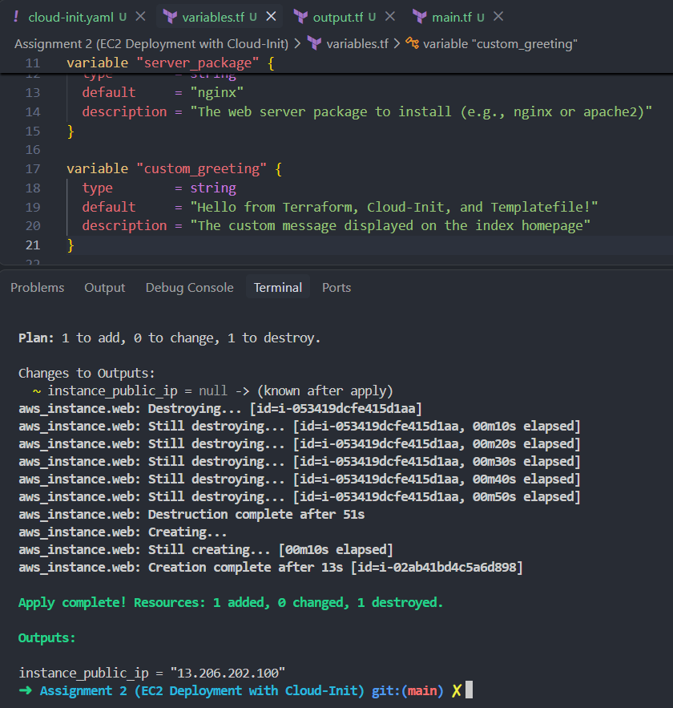
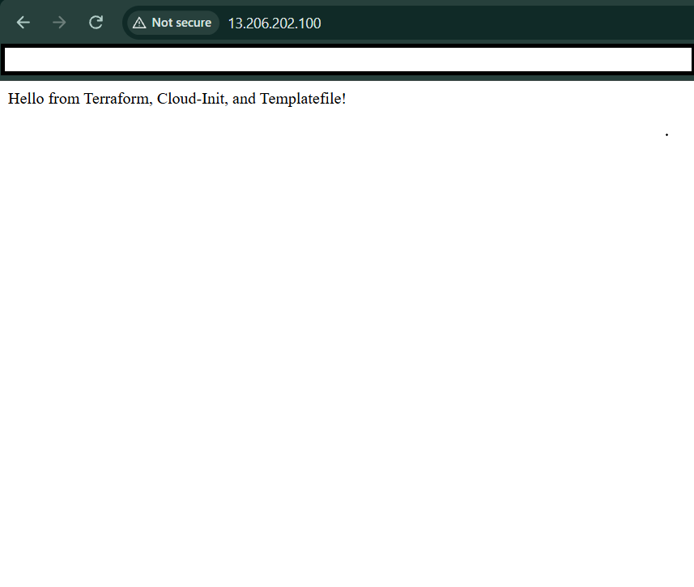

### Automated EC2 Web Server Deployment with Terraform & Cloud-Init

This repository contains an automated infrastructure-as-code solution to deploy a fully configured web server on AWS EC2. It leverages **Terraform** for resource provisioning and **Cloud-Init** for hands-free, zero-manual-intervention software setup on first boot.

### Architecture Diagram
```

       [ Public Web Browser ]
                 │
                 │ HTTP (Port 80)
                 ▼
┌──────────────────────────────────────────────┐
│                  AWS Cloud                   │
│                                              │
│  ┌────────────────────────────────────────┐  │
│  │              Default VPC               │  │
│  │                                        │  │
│  │  ┌──────────────────────────────────┐  │  │
│  │  │      Security Group (web_sg)     │  │  │
│  │  │  ┌────────────────────────────┐  │  │  │
│  │  │  │    EC2 Instance (web)      │  │  │  │
│  │  │  │  ┌──────────────────────┐  │  │  │  │
│  │  │  │  │     Ubuntu 22.04     │  │  │  │  │
│  │  │  │  ├──────────────────────┤  │  │  │  │
│  │  │  │  │ [Cloud-Init Process] │  │  │  │  │
│  │  │  │  │  ├── apt update      │  │  │  │  │
│  │  │  │  │  ├── apt install     │  │  │  │  │
│  │  │  │  │  │   (NGINX/Apache)  │  │  │  │  │
│  │  │  │  │  └── render index.html  │  │  │  │
│  │  │  │  └──────────────────────┘  │  │  │  │
│  │  │  └────────────────────────────┘  │  │  │
│  │  └──────────────────────────────────┘  │  │
│  └────────────────────────────────────────┘  │
└──────────────────────────────────────────────┘
```

### Features

* **Dynamic Templating**: Uses Terraform's templatefile() to inject structural configuration data and variables directly into the Cloud-Init configuration at runtime.
* **Zero Touch Configuration**: Installs, enables, and serves custom web pages natively during the instance's initial initialization sequence.
* **Auto-assigned Public IP**: Configured to forcefully acquire a public IPv4 routing address even when deployed into restricted subnet defaults.
* **Dynamic AMI Discovery**: Queries the Canonical AWS owner directory directly to guarantee usage of the most up-to-date, secure Ubuntu 22.04 LTS machine image.

### File Structure

├── cloud-init.yaml   # Cloud-config YAML template injected with variables
├── main.tf           # Core AWS provider infrastructure definitions
├── variables.tf      # Configuration variables (Region, instance sizing, packages)
└── outputs.tf        # Output templates generating public routing metrics

### Configuration Variables

|   Variable Name   |   Type   | Default Value |           Description           |
|-------------------|----------|---------------|---------------------------------|
|    `aws_region`   | `string` | `"ap-south-1"`|          Target AWS region      |
|  `instance_type`  | `string` |  `"t3.micro"` |         EC2 instance size       |
|  `server_package` | `string` |   `"nginx"`   | Web server (`nginx` / `apache2`)|
| `custom_greeting` | `string` |  `"Hello..."` |  Custom index.html home message |

### Quick Start & Deployment Guide

### Prerequisites

* Install [Terraform](https://developer.hashicorp.com/terraform/downloads) (v1.0.0+)
* Install the [AWS CLI](https://aws.amazon.com/cli/)
* Configured AWS programmatic credentials (aws configure)

### 1. Clone & Initialize

Prepare the working repository directory and pull down the requisite HashiCorp AWS provider binaries: 

```bash
terraform init
```

### 2. Verify Execution Plans

Inspect exactly what assets will be staged against your active infrastructure envelope before modifying live states: 

```bash
terraform plan
```

### 3. Apply Configuration

Provision the assets. This process completes quickly, prompting standard completion outputs: 

```bash
terraform apply -auto-approve
```

### 4. Verify Server Setup

Upon completion, the terminal will render an absolute IP mapping: 

```bash
Outputs:

instance_public_ip = "54.210.XX.XX"
```

Copy and paste this target straight into a web browser. 

**Note**: Cloud-init operates natively asynchronously during first boot. If the page fails to load immediately, wait **60–90 seconds** for standard operational routines (apt package installation) to fully finish. Also ensure to input 'http://' before the ip address.

## Screenshots

### 1. Terminal Output (`terraform apply`)
After running the apply command, Terraform will display the public routing endpoints:



### 2. Live Web Page Validation
Paste the `instance_public_ip` into your browser with 'http://' to view the dynamic index page configured by Cloud-Init:



### Troubleshooting Inside the Instance

If you encounter unexpected errors or your web server doesn't respond, SSH into your instance and check the Cloud-Init execution logs: 

* /var/log/cloud-init.log: Full system capture details mapping the state lifecycle execution.
* /var/log/cloud-init-output.log: Standard output captures capturing exact software packaging compilation and deployment errors.

### Resource Deconstruction

To completely wipe out all associated resources and avoid running up unwanted cloud charges, execute the standard destruction directive: 

```bash
terraform destroy -auto-approve
```